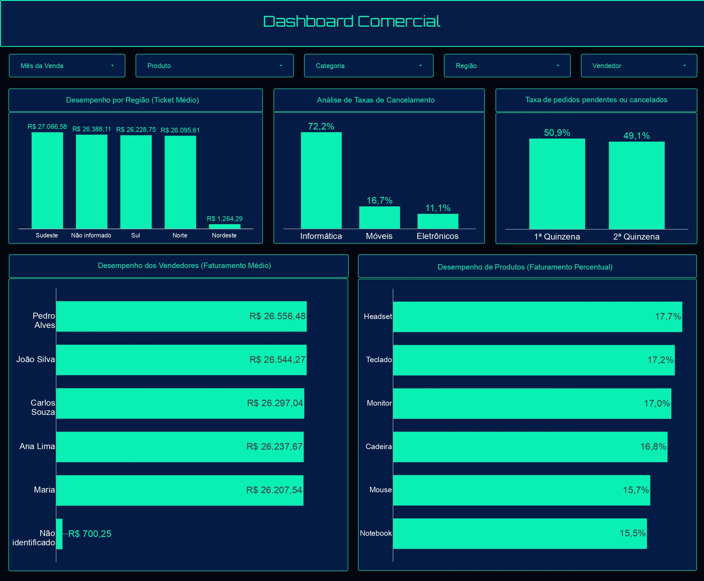

# Análise Comercial

> Projeto de Análise de Dados Comerciais com Jupyter Notebook e Dashboard no Data studio.

🔗 **[Data studio](https://datastudio.google.com/u/0/reporting/71286794-6bea-4589-80f4-940993a7abd3/page/gce4F)**



---

## 📌 Objetivo

> Este projeto tem como objetivo analisar dados de venda a fim de validar ou rejeitar hipóteses propostas pelas lideranças de áreas, apoiando decisões relacionadas a campanhas de marketing.
>## Hipóteses propostas:
> **- Desempenho por Região (Ticket Médio):** A região Sudeste apresenta um ticket médio por pedido significativamente maior do que a região Sul, justificando um maior investimento em marketing nessa área?
> **- Análise de Taxas de Cancelamento:** A categoria "Móveis" possui a maior taxa de pedidos cancelados ou devolvidos em comparação com "Eletrônicos" e "Informática"?
> **- Taxa de pedidos pendentes ou cancelados:** Existe uma concentração maior de vendas com status "Pendente" ou "Cancelado" na segunda quinzena do mês em comparação com a primeira quinzena?
> **- Desempenho de Produtos (Faturamento):** O produto "Notebook" é responsável pela maior parcela do faturamento total, superando os demais produtos?
> **- Desempenho dos Vendedores:** Os vendedores apresentam diferenças significativas no faturamento médio por venda, indicando que alguns vendedores possuem maior desempenho comercial?

## 🗂️ Fonte dos dados

- **Origem:** Dados sintéticos de cerca de 5000 registros de vendas
- **Período:** (ex: dados referentes a jan/2025 a dez/2026)

## 🛠️ Ferramentas utilizadas

- **Python** (Pandas) — tratamento de dados
- **Jupyter Notebook** — tratamento e análise exploratória (EDA)
- **Data Studio** — construção do dashboard final
- **Google Sheets** — fonte de dados para o Data Studio

## 📁 Estrutura do repositório

```
nome-do-projeto/
│
├── data/
│   ├── bruto/                     # dados brutos
│   └── tratado/                   # dados tratados, prontos para o dashboard
│
├── notebooks/
│   ├── 01_tratamento_dados.ipynb
│   └── 02_eda.ipynb
│
├── images/
│   └── dashboard_preview.png
│
├── .gitignore
├── requirements.txt
└── README.md
```

## 🔄 Pipeline do projeto

1. **Tratamento de dados** (`notebooks/01_tratamento_dados.ipynb`)
   - Leitura dos dados brutos (`data/bruto/`)
   - Limpeza: tipagem de colunas, padronização e missing values
   - Exportação do resultado para `data/tratado/`

2. **Análise Exploratória de Dados — EDA** (`notebooks/02_eda.ipynb`)
   - Leitura dos dados tratados (`data/bruto/`)
   - Estatísticas descritivas
   - Validações de hipóteses
   - Principais insights identificados

3. **Dashboard** (Data Studio)
   - Conexão com os dados tratados
   - Construção das visualizações finais
   - Publicação e compartilhamento do link público

> ⚠️ Execute os notebooks na ordem indicada pelo prefixo numérico (01, 02).

## 📊 Principais insights

Liste aqui, em bullet points, os 3-5 achados mais relevantes da EDA. Exemplo:

- A região sudeste possui um ticket médio maior que o ticket médio da região sul.
- A categoria Informática apresenta uma taxa de 72% de pedidos cancelados ou devolvidos em comparação com Móveis (16%)  e Eletrônicos (11%).
- A concentração maior de vendas com status "Pendente" ou "Cancelado" está na primeira quinzena dos meses.
- O produto com o maior percentual de faturamento é o Headset, com quase 17,7% do faturamento total.
- Existe uma diferença significativa entre o faturamento médio do vendedor João Silva e Carlos Souza, ou seja, João Silva vendeu em média aproximadamente R$247,22 a mais que Carlos Souza.

## 🚀 Como reproduzir o projeto

```bash
# Clone o repositório
git clone https://github.com/roger-teixeira-batista/analise-comercial.git

# Acesse a pasta
cd analise-comercial

# Crie um ambiente virtual (opcional, mas recomendado)
python -m venv venv
venv\Scripts\activate      # Windows
source venv/bin/activate   # Mac/Linux

# Instale as dependências
pip install -r requirements.txt

# Abra o Jupyter Notebook
jupyter notebook
```

## 👤 Roger Teixeira Batista

**Roger Teixeira Batista**
[[LinkedIn](https://www.linkedin.com/in/roger-teixeira-batista/)](#) | [GitHub](https://github.com/roger-teixeira-batista)
